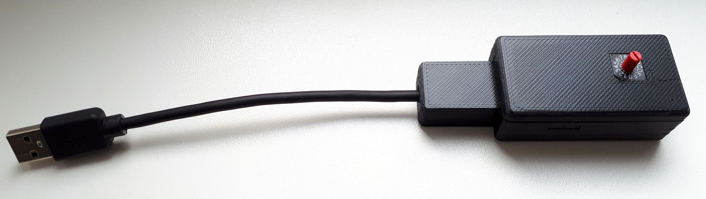
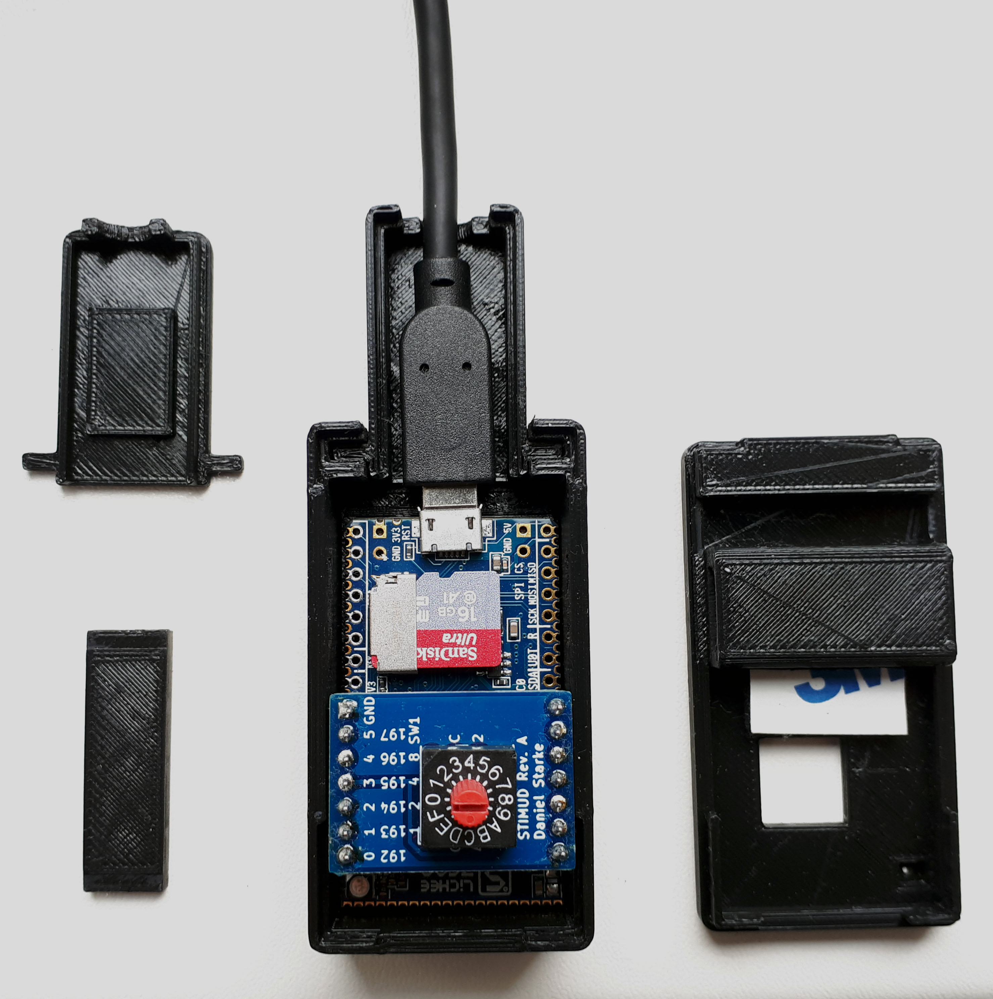
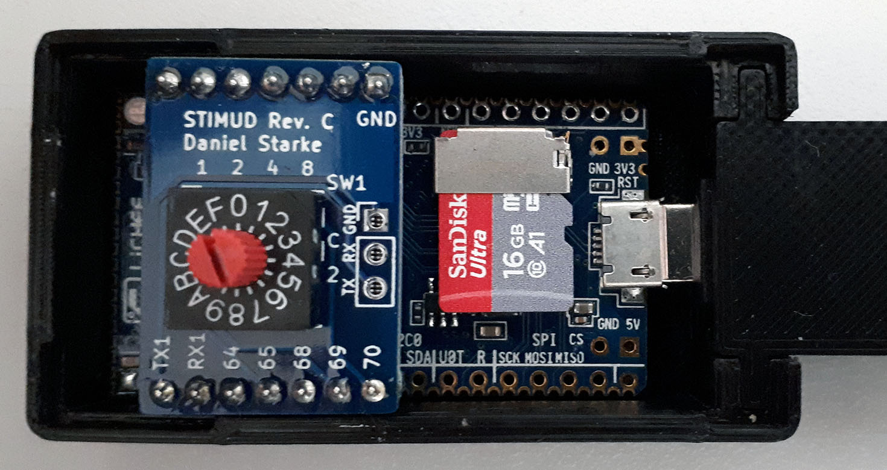
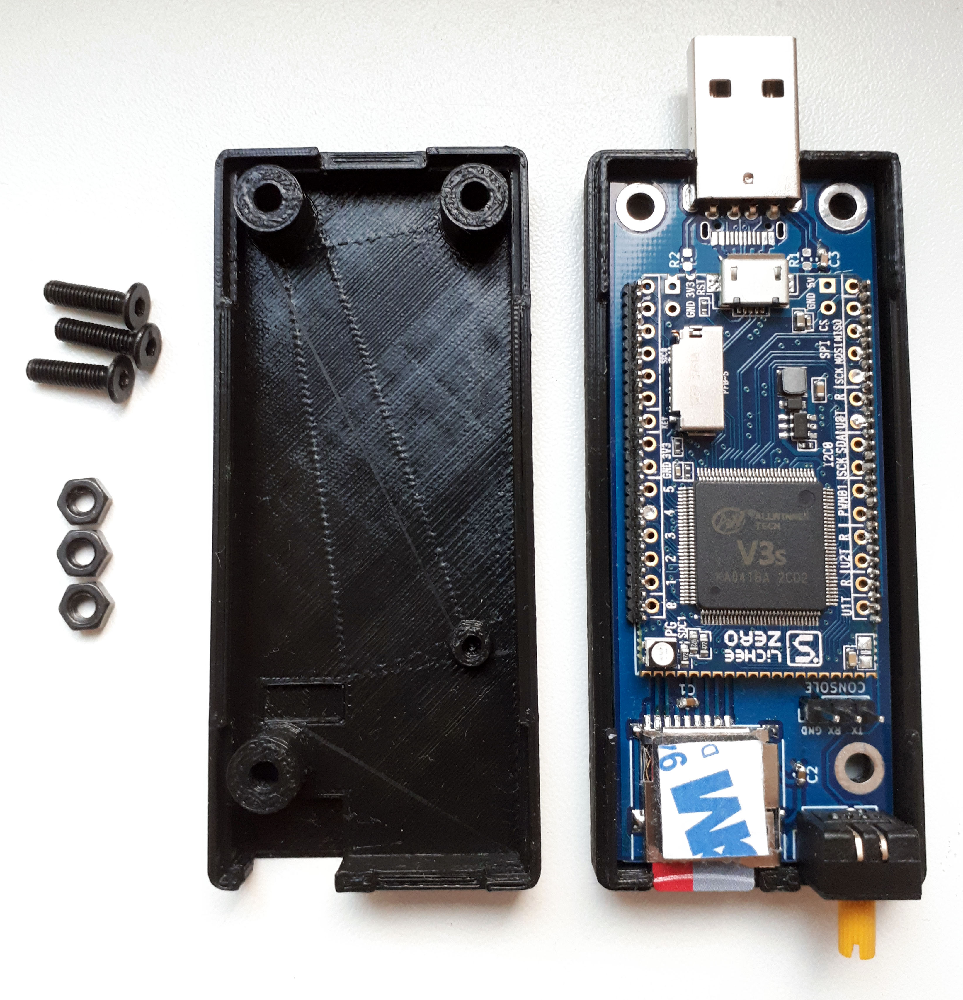
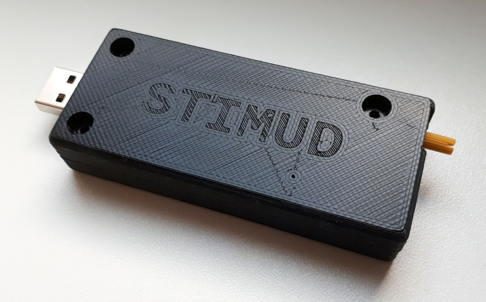

STIMUD
======

The **Sti**ck **Mu**lti **D**rive makes it possible to host multiple bootable USB images in one device.  


Features
========

- small and cheap design
- up to 16 different USB images in one device
- flexible storage capacity options by using standard microSD cards as backbone
- moderate speed: 6.36 MByte/s write, 17.2 MByte/s read ([tested](doc/h2testw-stimud.txt) with SunDisk Ultra 16GB)
- fast USB startup time of [~3 seconds](doc/startup-lz4.txt)
- as little as 0.7W energy consumption
- status and activity LED
- supported backbone file systems: FAT32, exFAT, NTFS, ext3 and ext4

Hardware Assembly
=================

STIMUD was made in three revisions. A, B and C. Each required a different level of soldering skills.  
Simple through-hole soldering skill is needed for revision A and C whereas C can be seen as improved version of A.  
Advanced SMD and through-hole soldering skills are needed to assemble revision B. Especially when using a USB-C connector.  

Required Tools
--------------

- soldering iron and lead
- 3D printer
- rasp
- glue
- microSD card reader/writer

Revision A and C
----------------

Needed parts:  
- 1x [LicheePi Zero](https://www.aliexpress.com/item/4000223515312.html)
- 1x [rotary switch with real or complementary code, 10 or 16 positions and a 3:1 or 3:3 footprint](https://lcsc.com/product-detail/Coded-Rotary-Switches_Knitter-switch_DRS4116_Knitter-switch-DRS4116_C237060.html)
- 2x [single row flat pin header with 7 pins](https://www.aliexpress.com/item/32977160718.html)
- 2x [single row flat pin socket with 7 pins](https://www.aliexpress.com/item/32977160718.html)
- 1x [micro USB cable](https://www.aliexpress.com/item/4000540452118.html)
- 1x [microSD card](https://www.aliexpress.com/item/33034672593.html)
- 1x [self adhesive 3mm thick foam pad](https://www.aliexpress.com/item/4000450236527.html)
- 1x [STIMUD PCB Rev. A](hw/switch-a/gerber) or 1x [STIMUD PCB Rev. C](hw/switch-c/gerber)
- 1x [STIMUD case](hw/switch-a/Case.FCStd)

The rotary switch and flat pin headers are soldered to the STIMUD PCB. See KiCAD project for [rev. A](hw/switch-a/switch.pro) or [rev. C](hw/switch-c/switch.pro).  
Gerber files for manufacturing at JLCPCB are provided [here](hw/switch-a/gerber) for rev. A and [here](hw/switch-c/gerber) for rev. C.  
Be sure to select 1.6mm PCB thickness or adjust the case dimensions.  
Also solder the flat pin sockets to the LicheePi Zero.  
The housing can be 3D printed via a FDM 3D printer. The needed STL files are found [here](hw/switch-a) for both revisions.  
Adjust the tolerance parameters in the [FreeCAD project](hw/switch-a/Case.FCStd) to match the used 3D printer performance.  
This step requires re-creation of the STL files for 3D printing. It is recommended to use the Mesh Design workspace in FreeCAD to adjust the quality settings before STL export.  
Be sure to print `CaseB.stl` and `ConA.stl` with support material. Some parts may need to be rasped for a proper fit afterwards.

Assembly example:  
  
  


Add some glue between ConA part and USB cable for pull relief.  
It may needs a little hole for the LED light in CaseB if the used case material transparency is insufficient.  
Revision C fixes the issue in revision A, that the LED shared the same pins as the rotary switch and also adds a serial console pin header.  

**It is highly recommended to use rev. C instead of rev. A.**

Note that the serial console function for rev. C is not yet implemented.

Revision B
----------

Needed parts:  
- 1x [LicheePi Zero](https://www.aliexpress.com/item/4000223515312.html)
- 1x [vertical rotary switch with real or complementary code, 10 or 16 positions and a 4:1 footprint](https://lcsc.com/product-detail/Coded-Rotary-Switches_Knitter-switch_DRR4016_Knitter-switch-DRR4016_C237044.html)
- 2x [single row pin header with 30 pins and 1.27mm spacing](https://lcsc.com/product-detail/Pin-Header-Female-Header_BOOMELE-Boom-Precision-Elec-1-27mm-1x50P_C3408.html)
- 1x [single row pin header with 3 pins and 2.54mm spacing](https://lcsc.com/product-detail/Pin-Header-Female-Header_BOOMELE-Boom-Precision-Elec-C49257_C49257.html) (optional)
- 1x [USB-A plug](https://lcsc.com/product-detail/USB-Connectors_Jing-Extension-of-the-Electronic-Co-C9739_C9739.html) or [USB-C receptacle](https://lcsc.com/product-detail/USB-Connectors_Korean-Hroparts-Elec-TYPE-C-31-M-12_C165948.html)
- 1x [microSD card socket](https://lcsc.com/product-detail/Card-Sockets-Connectors_Korean-Hroparts-Elec-TF-01A_C91145.html)
- 1x [microSD card](https://www.aliexpress.com/item/33034672593.html)
- 2x [5.1kOhm 0603 SMD resistor](https://lcsc.com/product-detail/Chip-Resistor-Surface-Mount_UNI-ROYAL-Uniroyal-Elec-0603WAF5101T5E_C23186.html)
- 1x [33kOhm 0603 SMD resistor](https://lcsc.com/product-detail/Chip-Resistor-Surface-Mount_UNI-ROYAL-Uniroyal-Elec-0603WAF3302T5E_C4216.html) (optional)
- 6x [100nF 0603 SMD capacitor](https://lcsc.com/product-detail/Multilayer-Ceramic-Capacitors-MLCC-SMD-SMT_IHHEC-HOLY-STONE-ENTERPRISE-CO-LTD-C0603X104K050T_C187860.html)
- 1x [self adhesive 3mm thick foam pad](https://www.aliexpress.com/item/4000450236527.html)
- 3x [M3 nut](https://www.aliexpress.com/item/32981886856.html)
- 3x [12mm M3 screw](https://www.aliexpress.com/item/32981886856.html)
- 1x [STIMUD PCB Rev. B](hw/switch-b/gerber)
- 1x [STIMUD case](hw/switch-b/Case.FCStd)

The rotary switch, pin headers, microSD card socket, USB connector, SMD resistors and capacitors are soldered to the STIMUD PCB. The 5.1kOhm resistors are only needed for
the variant with the USB-C receptacle. See KiCAD project for [rev. B](hw/switch-b/switch.pro).  
Gerber files for manufacturing at JLCPCB are provided [here](hw/switch-b/gerber).  
Be sure to select 1.2mm PCB thickness or adjust the case dimensions.  
The LicheePi Zero is soldered directly to the pin headers previously soldered to the STIMUD PCB. Be sure to finish soldering the capacitors before attaching the LicheePi Zero.  
The housing can be 3D printed via a FDM 3D printer. The needed STL files are found [here](hw/switch-b) for the USB-A variant.  
Adjust the tolerance parameters in the [FreeCAD project](hw/switch-b/Case.FCStd) to match the used 3D printer performance.  
This step requires re-creation of the STL files for 3D printing. It is recommended to use the Mesh Design workspace in FreeCAD to adjust the quality settings before STL export.  
Everything can be printed without support material.

Assembly example:  
  


Attach the self adhesive foam pad on the microSD card socket to avoid unaligned insertions of microSD cards.

Note that there exists no housing for the USB-C receptacle variant yet.

**Important: Never operate the STIMUD REV B with two microSD cards at the same time! This will damage the cards and the LicheePi Zero board.**

Software Setup
==============

Build Pre-requirements
----------------------

The initial boot image can be build in Linux using the provided `build.sh` script.  
For the pre-requirements see https://buildroot.org/downloads/manual/manual.html#requirement

Build Boot Image
----------------

Execute `build.sh`. The resulting image can be found in `build/output/images/`. Additional flags can be passed to `build.sh` to control the build output.  
Use dd on Linux or [Rufus](https://rufus.ie/) on Windows to flash the microSD card.  
The partition for the sub images will be created automatically by STIMUD according to `stimud.cfg` after first start, which may take a bit longer.  
A pre-compiled image is also provided.

Configuration
-------------

Set the rotary switch to position **`F`** and adjust `stimud.cfg`.  
You can change the properties of the rotary switch coding, preferred backbone filesystem and image configurations here.  
Note that the backbone filesystem option is only used for initial format. Any of the supported filesystems can be used.  
Images can be copied as image files or created for example with the following Linux command:  

```shell
for i in 0 1 2 3 4 5 6 7 8 9 A B C D E; do dd if=/dev/zero of=$i.img bs=1048576 count=1008; mkfs -t vfat $i.img; done
```

This creates the images 0.img, 1.img, 2.img, 3.img, 4.img, 5.img, 6.img, 7.img, 8.img, 9.img, A.img, B.img, C.img, D.img and E.img in the current directory with a size of 1018MB each formatted with FAT32.  
Note that the configuration file `stimud.cfg` can be located in three locations:

1. secondary partition on the microSD card (which also includes the images)
2. primary partition on the microSD card
3. Linux kernel initfs

The priority is handled in the order given above. A missing file is replaced by the next location in the list.

Usage
=====

After successful configuration, set the rotary switch to the desired position before plugging it to the host.  
The current image can be changed at any time and will be effective on next connection to the host.  
Each image file represents a full USB storage drive image.  
Usually one position remains reserved to access the STIMUD configuration. This is position `F` by default.

Access to the internal command-line console is provided in STIMUD rev. B and C via a 3.3V TTL UART connection
with 115200 Baud, 8 data bits, no parity and 1 stop bit. The STIMUD related files are stored there in `/root`.
[Such](https://www.aliexpress.com/item/32617951363.html) an FT232R adapter module can be used for example, to connect a PC to it.

**Important: Never operate the STIMUD REV B with two microSD cards at the same time! This will damage the cards and the LicheePi Zero board.**

LED States
==========

|LED              |State                 |Meaning
|:---------------:|----------------------|----------------------------------------
|| green blinking       |starting
|| blue blinking        |disk activity after successful startup
|| red blinking         |script error (check `stimud.sh`)
|| red/blue alternating |configuration error (check `stimud.cfg`)
|| red always on        |unknown error

Note that the LEDs in revision A are also connected to the rotary switch. Set it to position `0` or
`F` depending on whether the switch uses real or complementary code to see all LEDs. Other positions
may disable all or some LEDs. Revision C fixes this issue by using different pins for the rotary switch.

License
=======

See [copying file](doc/COPYING).  

Contributions
=============

No content contributions are accepted. Please file a bug report or feature request instead.  
This decision was made in consideration of the used license.
